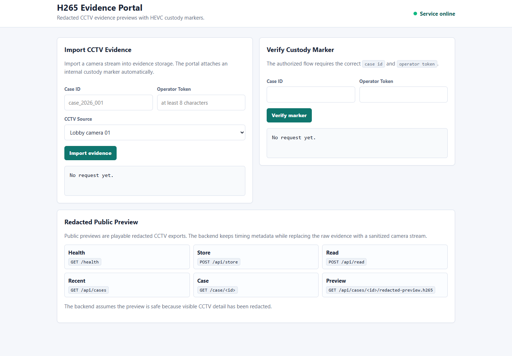
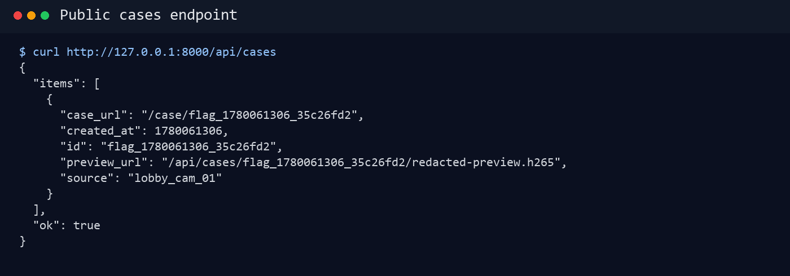
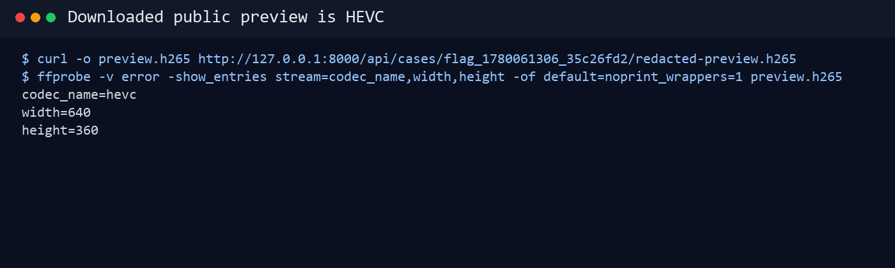
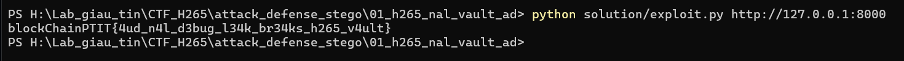

# H265 Evidence Portal AD - Writeup Attack

## 1. Nhìn bài và hiểu bối cảnh

Service là một cổng lưu trữ bằng chứng CCTV. Người điều tra import một case vào
hệ thống, service lưu raw evidence dưới dạng H.265/HEVC Annex-B và gắn thêm một
custody marker nội bộ. Trong môi trường CTF, checker đặt flag vào marker này.

Có hai luồng cần phân biệt:

- Luồng hợp lệ: `/api/read` và `/api/carrier` yêu cầu đúng `case id` và
  `operator token`.
- Luồng public: `/api/cases`, `/share/<share_id>`,
  `/api/share/<share_id>/manifest.json` và
  `/api/cases/<id>/redacted-preview.h265` không yêu cầu token.

Ở bản nâng cấp, service không chỉ là API đặt/đọc flag. Nó có operator console,
camera registry, public share link, manifest và audit trail. Khi deploy bằng
Docker, frontend tĩnh, backend API và PostgreSQL database cũng được tách thành
các container riêng. Các lớp này làm kịch bản giống một hệ thống lưu trữ CCTV
hơn, nhưng bug chính vẫn nằm ở public redacted preview.

Điểm đáng nghi nằm ở preview public. Giao diện nói đây là bản CCTV đã redact,
vẫn phát được như H.265, nhưng backend giữ lại timing metadata. Với video HEVC,
metadata này nằm trong các NAL unit, đặc biệt là AUD NAL type 35.

## 2. Target được cấp

Trong vai trò attacker, ta không dựng service và cũng không thao tác trong
container của đội phòng thủ. Ta chỉ được cấp một URL target, ví dụ khi test local:

```text
http://127.0.0.1:8000/
```

Trong giải thật, URL có thể là:

```text
http://<team-host>:<port>/
```

Các bước bên dưới đều thực hiện từ bên ngoài hệ thống, giống một người truy cập
web bình thường.

## 3. Recon dashboard

Mở dashboard bằng trình duyệt:

```text
http://127.0.0.1:8000/
```



Trên dashboard có ba ý quan trọng:

- Có form import CCTV evidence.
- Có form verify custody marker bằng `case id` và `operator token`.
- Có camera registry, audit feed, public share/manifest và redacted preview cho
  từng case.

Từ góc nhìn attacker, token là thứ không có. Vì vậy hướng hợp lý là tìm những
endpoint public trước.

## 4. Tìm case public

Liệt kê các case public:

```bash
curl http://127.0.0.1:8000/api/cases
```



Output trả về có dạng:

```json
{
  "items": [
    {
      "case_url": "/case/flag_1780132060_da66f92c",
      "camera": "Lobby camera 01",
      "created_at": 1780132060,
      "id": "flag_1780132060_da66f92c",
      "manifest_url": "/api/share/8a7f.../manifest.json",
      "preview_url": "/api/cases/flag_1780132060_da66f92c/redacted-preview.h265",
      "redaction_profile": "faces+badges",
      "share_url": "/share/8a7f...",
      "source": "lobby_cam_01"
    }
  ],
  "ok": true
}
```

Thông tin quan trọng nhất là `id` và `preview_url`.

Attacker không có `operator token`, nên không thể dùng luồng hợp lệ để đọc marker
qua `/api/read`. Tuy nhiên `preview_url` là public, nên attacker có thể tải bản
redacted preview về để phân tích.

## 5. Tải preview và kiểm tra file H.265

Tải preview:

```bash
curl.exe -L -o preview.h265 http://127.0.0.1:8000/api/cases/flag_1780132060_da66f92c/redacted-preview.h265
```

Kiểm tra file đã tải:

```bash
dir preview.h265
```

Kiểm tra bằng `ffprobe`:

```bash
ffprobe -v error -show_entries stream=codec_name,width,height -of default=noprint_wrappers=1 preview.h265
```



Kết quả:

```text
codec_name=hevc
width=640
height=360
```

Điều này cho thấy preview không phải file text hay file giả. Nó là raw HEVC/H.265
bitstream thật, có thể được `ffprobe` nhận diện.

Vì vậy hướng khai thác hợp lý là parse cấu trúc H.265 Annex-B, không phải tìm
flag trực tiếp bằng `strings`.

## 6. Phân tích cấu trúc H.265 Annex-B

HEVC Annex-B dùng start code để tách NAL unit:

```text
00 00 01
00 00 00 01
```

Mỗi đoạn sau start code là một NAL unit. Với HEVC, `nal_unit_type` nằm trong
header byte đầu:

```python
nal_unit_type = (nal[0] >> 1) & 0x3f
```

Bài này dùng AUD NAL:

```text
nal_unit_type = 35
```

Trong AUD, byte payload đầu tiên chứa `primary_pic_type` ở 3 bit cao:

```python
primary_pic_type = (nal[2] >> 5) & 0x07
raw_bit = primary_pic_type & 1
```

Nếu bài đơn giản, chỉ cần nối `raw_bit` của toàn bộ AUD là ra flag. Nhưng bản này
có thêm decoy, Manchester encoding và XOR mask theo `case id`, nên phải giải
ngược đúng thuật toán.

## 7. Reverse thuật toán nhúng

Trong source service, khi lưu marker, backend gọi:

```python
bitstream = embed_secret(secret, seed=item_id)
```

Vậy seed không phải token. Seed chính là `case id`, mà attacker đã lấy được từ
`/api/cases`.

Packet gốc có cấu trúc:

```text
H5AD || 2-byte length || marker || crc32(marker)
```

Trước khi nhúng vào AUD, service xử lý packet như sau:

```text
packet bytes
-> đổi sang bit MSB-first
-> XOR với keystream SHA256("h265-ad-mask:" || case_id || counter)
-> Manchester encode: 0 -> 01, 1 -> 10
-> trước mỗi bit thật chèn 1-3 AUD giả
-> ghi bit thật vào primary_pic_type & 1 của AUD data
```

Do đó quá trình giải phải làm ngược lại:

```text
preview.h265
-> tách NAL
-> lọc AUD type 35
-> lấy raw_bit = primary_pic_type & 1
-> sinh cadence từ case id để bỏ AUD giả
-> lấy các encoded bit thật
-> Manchester decode
-> XOR lại bằng mask theo case id
-> parse H5AD, length, marker, crc32
```

## 8. Chạy exploit

Chạy exploit tự động:

```bash
python solution/exploit.py http://127.0.0.1:8000
```

Hoặc nếu đã biết `case id`:

```bash
python solution/exploit.py http://127.0.0.1:8000 --id flag_1780132060_da66f92c
```



Output:

```text
blockChainPTIT{4ud_n4l_d3bug_l34k_br34ks_h265_v4ult}
```

## 9. Kết luận attack

Lỗi không nằm ở việc `/api/read` thiếu kiểm tra token. Route đó vẫn kiểm tra đúng.

Lỗi nằm ở assumption sai của preview pipeline: hệ thống nghĩ AUD chỉ là timing
metadata vô hại, nhưng marker lại được giấu trong AUD. Vì preview public copy AUD
nguyên vẹn và `case id` public đủ để khôi phục cadence/mask, attacker có thể lấy
flag chỉ từ redacted preview.
