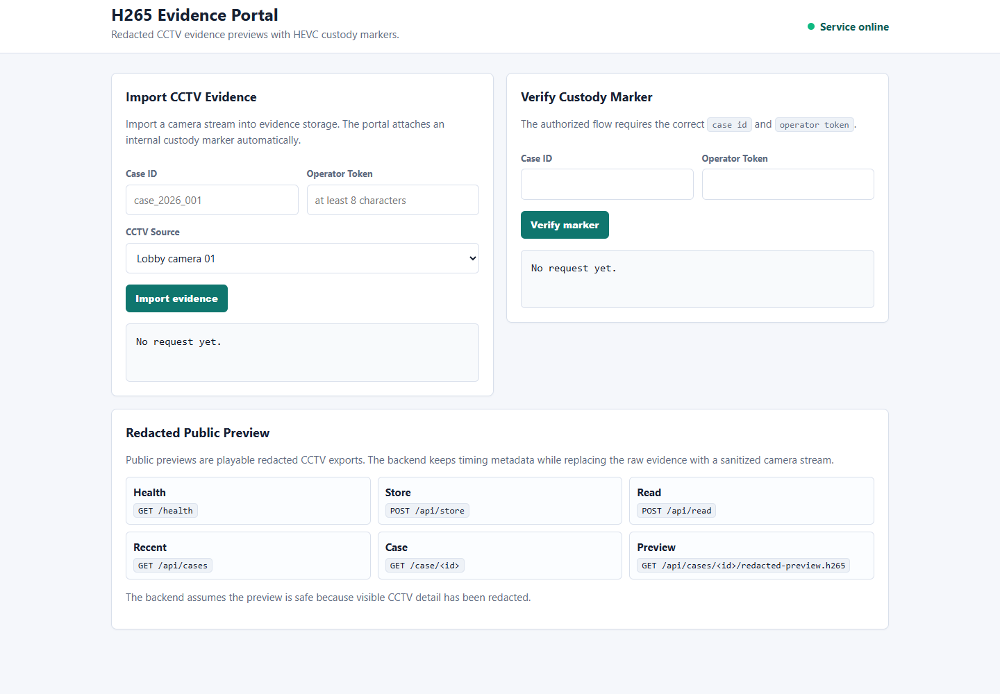
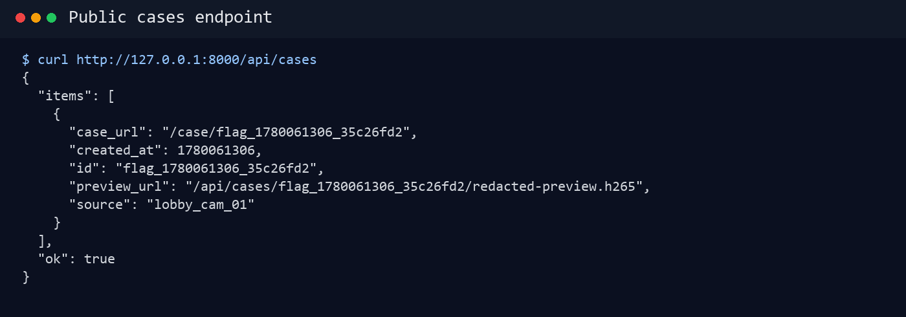
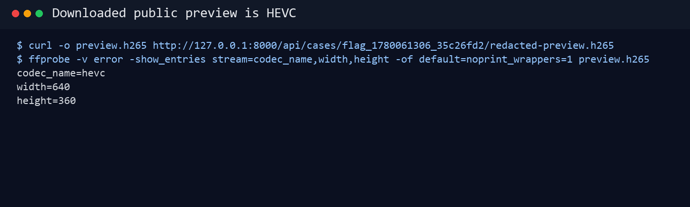
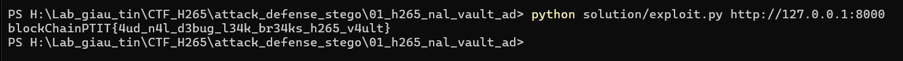

# H265 Evidence Portal AD - Writeup Attack

## 1. Root bug

Bug lớn của bài không phải là một endpoint quên check token. `/api/read` và `/api/carrier`
vẫn cần `operator token`.

Bug nằm ở thiết kế public preview:

```text
Backend tạo redacted-preview.h265 bằng cách copy lại NAL từ raw evidence carrier.
Nó chỉ nghĩ tới phần hình ảnh đã redact, nhưng quên rằng H.265 còn nhiều NAL metadata.
```

Trong hệ thống này, custody marker nội bộ được nhúng vào raw carrier để phục vụ kiểm tra
chuỗi bằng chứng. Khi preview public copy metadata từ carrier, marker bị lộ qua nhiều
đường khác nhau. Đây là một bug lớn kiểu attack-defense thật: defender vá một dấu hiệu
thì attacker vẫn có thể thử các đường leak khác sinh ra từ cùng một sai lầm thiết kế.

## 2. Recon public surface

Attacker chỉ có URL service:

```text
http://127.0.0.1:8000/
```

Mở dashboard:

```text
http://127.0.0.1:8000/
```



Endpoint public quan trọng:

```bash
curl http://127.0.0.1:8000/api/cases
```



Response có `id`, `preview_url`, `share_url`, `manifest_url`. Attacker không có token,
nhưng có thể tải public preview:

```bash
curl.exe -L -o preview.h265 http://127.0.0.1:8000/api/cases/flag_1780132060_da66f92c/redacted-preview.h265
```

Kiểm tra file:

```bash
ffprobe -v error -show_entries stream=codec_name,width,height -of default=noprint_wrappers=1 preview.h265
```



Kết quả:

```text
codec_name=hevc
width=640
height=360
```

Vậy hướng khai thác đúng là parse H.265 Annex-B, không phải tìm flag bằng `strings`.

## 3. Hướng khai thác 1: AUD timing channel

HEVC Annex-B dùng start code để tách NAL:

```text
00 00 01
00 00 00 01
```

Với HEVC:

```python
nal_unit_type = (nal[0] >> 1) & 0x3f
```

AUD có `nal_unit_type = 35`. Service giấu marker vào bit thấp của `primary_pic_type`:

```python
primary_pic_type = (nal[2] >> 5) & 0x07
raw_bit = primary_pic_type & 1
```

Marker không được ghi thẳng. Nó được đóng gói:

```text
H5AD || 2-byte length || marker || crc32(marker)
```

Sau đó:

```text
packet bits
-> XOR keystream theo case id
-> Manchester encode
-> chèn 1-3 AUD giả trước mỗi bit thật
-> ghi bit thật vào primary_pic_type & 1
```

Vì `case id` public trong `/api/cases`, attacker sinh lại được cadence và mask.

Chạy exploit bằng AUD:

```bash
python solution/exploit.py http://127.0.0.1:8000 --id flag_1780132060_da66f92c --vector aud
```



Output:

```text
blockChainPTIT{4ud_n4l_d3bug_l34k_br34ks_h265_v4ult}
```

## 4. Hướng khai thác 2: SEI debug trace

Nếu defender chỉ strip AUD type 35, root bug vẫn chưa hết. Carrier còn có một operator
trace/debug NAL trong SEI prefix type 39. Trace này không dùng cho `/api/read`, nhưng
được sinh ra để mô phỏng metadata debug/custody trace hay gặp trong hệ thống xử lý video.

SEI trace có dạng:

```text
H5DBG || 2-byte length || xor(packet, SHA256("h265-ad-sei-trace:" || case_id || counter))
```

Vì preview sanitizer copy metadata, SEI cũng đi ra public preview. Attacker chỉ cần lọc
NAL type 39/40, tìm `H5DBG`, XOR lại bằng `case id`, rồi parse packet `H5AD`.

Chạy exploit bằng SEI:

```bash
python solution/exploit.py http://127.0.0.1:8000 --id flag_1780132060_da66f92c --vector sei
```

Nếu AUD đã bị strip nhưng SEI vẫn còn, lệnh này vẫn lấy được flag.

## 5. Hướng khai thác 3: stale preview artifact

Ngay cả khi defender đã sửa code để strip AUD và SEI, attacker vẫn nên thử lại preview
cũ. Backend cache preview trên disk:

```python
preview_path = PREVIEW_DIR / f"{item_id}_redacted_preview.h265"
if not preview_path.exists():
    preview_path = _render_preview(item_id)
```

Nếu preview đã được render trước khi vá, file cũ vẫn có thể nằm trong cache. Khi attacker
gọi lại URL public, service trả artifact cũ thay vì render lại bằng sanitizer mới.

Kiểm tra nhanh:

```bash
curl -L -o stale_preview.h265 http://127.0.0.1:8000/api/cases/flag_1780132060_da66f92c/redacted-preview.h265
python solution/exploit.py http://127.0.0.1:8000 --id flag_1780132060_da66f92c --vector auto
```

Nếu cache cũ còn đó, exploit vẫn có thể lấy flag.

## 6. Exploit tổng hợp

Trong thực chiến, attacker không cần biết trước đội phòng thủ đã vá tới đâu. Dùng mode
`auto` để thử cả AUD và SEI:

```bash
python solution/exploit.py http://127.0.0.1:8000
```

Hoặc chỉ định case id:

```bash
python solution/exploit.py http://127.0.0.1:8000 --id flag_1780132060_da66f92c
```

Exploit thành công khi in ra flag động do checker đặt:

```text
blockChainPTIT{...}
```

## 7. Kết luận attack

Đây là một root bug về trust boundary của preview pipeline:

```text
Public artifact được tạo từ private carrier bằng denylist/sanitize hời hợt.
```

Các hướng AUD, SEI và stale cache chỉ là biểu hiện khác nhau của cùng một lỗi. Defense
đúng không phải là vá từng pattern, mà là thiết kế lại preview theo allowlist metadata
an toàn và invalidate toàn bộ artifact cũ.
