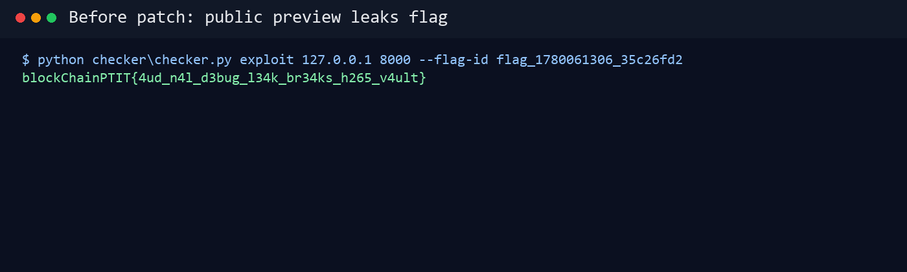
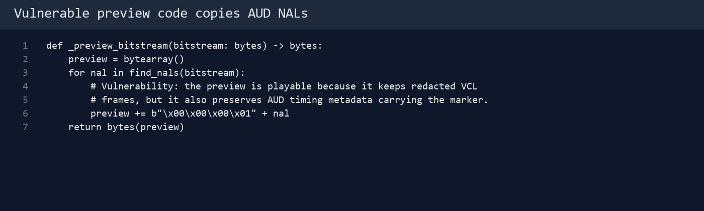
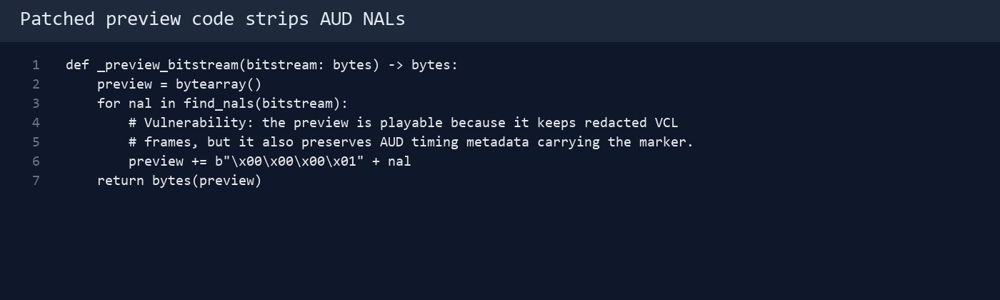
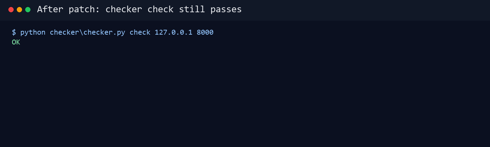
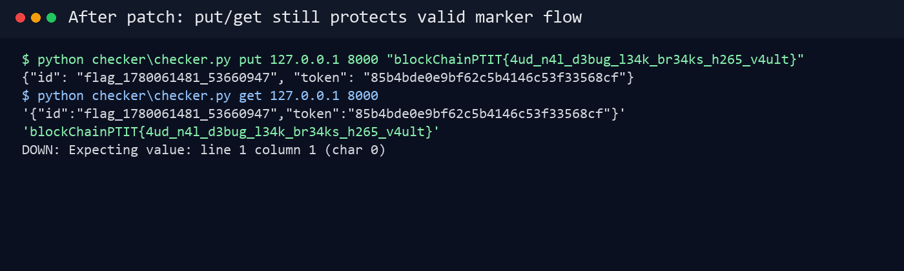
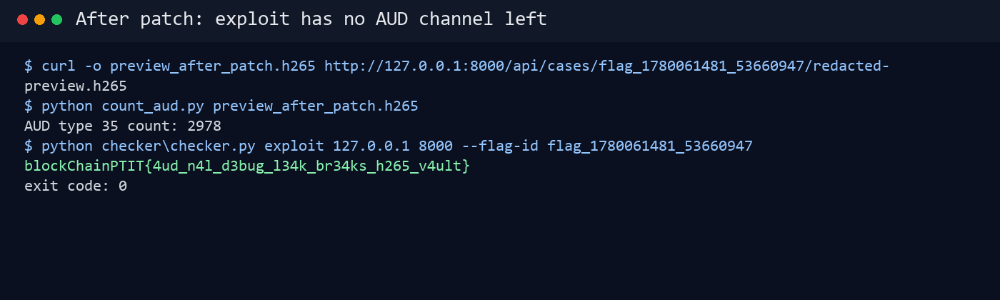

# H265 Evidence Portal AD - Writeup Defense

## 1. Mục tiêu khi phòng thủ

Defense trong bài này không phải là tắt service cho attacker hết đường khai
thác. Trong attack/defense CTF, service vẫn phải sống và checker vẫn phải dùng
được các chức năng hợp lệ:

- `/health` phải trả service còn sống.
- `/api/store` phải import case và lưu marker.
- `/api/read` phải đọc lại marker khi có đúng token.
- Dashboard `/`, `/api/cases`, `/case/<id>` và preview vẫn nên tồn tại để giữ
  đúng chức năng evidence portal.

Vì vậy bản vá tốt phải xử lý đúng kênh leak, không phá luồng nghiệp vụ.

## 2. Chứng minh lỗi trước khi vá

Chạy service:

```bash
cd attack_defense_stego/01_h265_nal_vault_ad/service
docker compose up --build -d
```

Đặt một flag mẫu bằng checker:

```bash
cd ..
python checker/checker.py put 127.0.0.1 8000 'blockChainPTIT{4ud_n4l_d3bug_l34k_br34ks_h265_v4ult}'
```

Ví dụ output:

```json
{"id":"flag_1710000000_abcd1234","token":"0123456789abcdef"}
```

Ở đây `token` là bí mật của luồng hợp lệ. Attacker không cần token nếu khai thác
preview public.

Liệt kê case public:

```bash
curl http://127.0.0.1:8000/api/cases
```

Tải preview:

```bash
curl -o preview.h265 http://127.0.0.1:8000/api/cases/flag_1710000000_abcd1234/redacted-preview.h265
```

Kiểm tra preview vẫn là HEVC:

```bash
ffprobe -v error -show_entries stream=codec_name,width,height -of default=noprint_wrappers=1 preview.h265
```

Kết quả:

```text
codec_name=hevc
width=640
height=360
```

Chạy exploit:

```bash
python checker/checker.py exploit 127.0.0.1 8000 --flag-id flag_1710000000_abcd1234
```

Nếu chưa vá, exploit in ra flag:

```text
blockChainPTIT{4ud_n4l_d3bug_l34k_br34ks_h265_v4ult}
```



Kết luận: preview public đủ dữ liệu để khôi phục marker, dù `/api/read` vẫn yêu
cầu token.

## 3. Xác định nguyên nhân gốc

Mở `service/app.py`, hàm tạo preview:

```python
def _preview_bitstream(bitstream: bytes) -> bytes:
    preview = bytearray()
    for nal in find_nals(bitstream):
        # Vulnerability: the preview is playable because it keeps redacted VCL
        # frames, but it also preserves AUD timing metadata carrying the marker.
        preview += b"\x00\x00\x00\x01" + nal
    return bytes(preview)
```



Vấn đề là hàm này copy toàn bộ NAL sang preview. Nó giữ được video preview phát
được, nhưng cũng giữ luôn AUD NAL type 35.

Mở tiếp `service/stego.py`, phần nhúng marker:

```python
bits = _manchester_encode(_xor_bits(_bytes_to_bits(packet), seed))
```

Packet gốc:

```text
H5AD || 2-byte length || marker || crc32(marker)
```

Sau đó service dùng cadence theo `case id` để chèn AUD giả:

```python
decoys = 1 + (next(cadence) % 3)
```

Và ghi bit thật vào AUD data:

```python
primary_pic_type = (cover << 1) | bit
aud_rbsp = bytes([(primary_pic_type << 5) | 0x10])
marker += _nal(35, aud_rbsp)
```

Điểm quan trọng: AUD giả, Manchester và XOR chỉ làm attack khó hơn. Nó không
phải defense, vì attacker có `case id` public để sinh lại cadence và mask. Nếu
AUD vẫn nằm trong preview thì marker vẫn leak.

## 4. Nguyên tắc vá đúng

Ta cần giữ các yêu cầu sau:

- Preview vẫn trả về HEVC để người dùng tải/xem được.
- Không public raw carrier yêu cầu token.
- Không làm hỏng `/api/store` và `/api/read`.
- Không để AUD chứa marker xuất hiện trong preview public.

Với bài này, cách vá gọn nhất là strip AUD NAL type 35 khi tạo preview:

```python
def _preview_bitstream(bitstream: bytes) -> bytes:
    preview = bytearray()
    for nal in find_nals(bitstream):
        if nal_type(nal) == 35:
            continue
        preview += b"\x00\x00\x00\x01" + nal
    return bytes(preview)
```



Lý do chọn cách này:

- Marker chỉ nằm trong AUD type 35.
- Các VCL frame của preview vẫn được giữ.
- Checker không phụ thuộc preview để đọc marker, checker dùng `/api/read`.
- Thay đổi nhỏ, dễ review trong A/D CTF.

## 5. Áp dụng patch mẫu

Patch đã có sẵn:

```bash
git apply solution/defense.patch
```

Có thể kiểm tra patch trước:

```bash
git apply --check solution/defense.patch
```

Nếu muốn sửa tay, chỉ cần thêm đoạn:

```python
if nal_type(nal) == 35:
    continue
```

trong vòng lặp của `_preview_bitstream`.

## 6. Rebuild service sau khi vá

Sau khi sửa code:

```bash
cd service
docker compose down
docker compose up --build -d
```

Kiểm tra service sống:

```bash
curl http://127.0.0.1:8000/health
```

Kết quả:

```json
{"ok":true}
```

Kiểm tra dashboard vẫn trả HTML:

```bash
curl http://127.0.0.1:8000/
```

Nếu thấy HTML chứa `H265 Evidence Portal` là ổn.

## 7. Kiểm tra chức năng hợp lệ không hỏng

Chạy checker tổng quát:

```bash
cd attack_defense_stego/01_h265_nal_vault_ad
python checker/checker.py check 127.0.0.1 8000
```

Output mong đợi:

```text
OK
```



Kiểm tra rõ hơn bằng `put` và `get`:

```bash
python checker/checker.py put 127.0.0.1 8000 'blockChainPTIT{4ud_n4l_d3bug_l34k_br34ks_h265_v4ult}'
```

Ví dụ output:

```json
{"id":"flag_1710000000_abcd1234","token":"0123456789abcdef"}
```

Dùng lại JSON đó:

```bash
python checker/checker.py get 127.0.0.1 8000 '{"id":"flag_1710000000_abcd1234","token":"0123456789abcdef"}' 'blockChainPTIT{4ud_n4l_d3bug_l34k_br34ks_h265_v4ult}'
```

Output mong đợi:

```text
OK
```



Điều này chứng minh defense không làm hỏng chức năng lưu và đọc marker hợp lệ.

## 8. Chứng minh exploit bị chặn

Sau khi vá, preview public vẫn tồn tại:

```bash
curl -I http://127.0.0.1:8000/api/cases/flag_1710000000_abcd1234/redacted-preview.h265
```

Nhưng exploit không còn lấy được flag:

```bash
python checker/checker.py exploit 127.0.0.1 8000 --flag-id flag_1710000000_abcd1234
```

Kết quả hợp lệ là exploit không in flag và trả exit code khác 0. Lý do là
preview không còn AUD type 35, nên attacker không còn raw bit để bỏ decoy,
decode Manchester hay XOR mask.

Có thể kiểm tra nhanh số lượng AUD trong preview sau vá bằng một script parse
NAL. Kết quả mong muốn:

```text
AUD type 35 count: 0
```



## 9. Vì sao không nên vá bằng cách khác

Không nên chỉ đổi thuật toán encode phức tạp hơn, ví dụ tăng decoy, đổi XOR
mask hoặc đổi Manchester. Các cách đó chỉ trì hoãn attacker, vì nếu preview vẫn
copy kênh chứa marker thì người chơi có thể reverse tiếp.

Không nên tắt `/api/cases` hoặc `/case/<id>` nếu đề bài yêu cầu giữ chức năng
portal public. Tắt chức năng làm bài mất tính attack/defense và có thể khiến
checker hoặc workflow hợp lệ bị ảnh hưởng.

Không nên yêu cầu token cho preview nếu kịch bản sản phẩm cần public redacted
preview. Trong thực tế có thể làm vậy, nhưng với bài này defense đẹp hơn là giữ
preview public và loại bỏ đúng dữ liệu nhạy cảm khỏi preview.

## 10. Defense tốt hơn trong thực tế

Bản vá strip AUD là đủ cho bài CTF. Trong sản phẩm thật, nên làm thêm:

- Tạo preview bằng transcoder sạch thay vì copy NAL từ evidence carrier.
- Nếu cần AUD, tạo AUD mới trung tính thay vì copy AUD cũ.
- Không dùng metadata/timing field làm nơi chứa marker nhạy cảm.
- Mã hóa marker bằng key server-side nếu bắt buộc phải nhúng.
- Thêm log và rate limit cho `/api/cases/<id>/redacted-preview.h265`.
- Rotate marker/flag đã bị lộ sau khi deploy bản vá.

## 11. Ảnh chụp đã kèm

Các ảnh minh họa đã được lưu trong `solution/screenshots/`:

- `defense-01-before-exploit-leaks-flag.png`: exploit lấy được flag trước vá.
- `defense-02-vulnerable-preview-code.png`: `_preview_bitstream` copy mọi NAL.
- `defense-03-patched-preview-code.png`: preview bỏ `nal_type(nal) == 35`.
- `defense-04-checker-ok-after-patch.png`: checker `check` trả `OK`.
- `defense-05-get-ok-after-patch.png`: `put/get` vẫn đọc marker hợp lệ.
- `defense-06-exploit-blocked.png`: exploit không còn in flag.

## 12. Tóm tắt để đưa vào báo cáo

```text
Lỗi nằm ở public redacted preview. Preview được xem là an toàn vì hình ảnh CCTV
đã redact, nhưng backend copy nguyên AUD NAL type 35 từ evidence carrier. Marker
được giấu trong chuỗi AUD bằng decoy, Manchester và XOR theo case id; các lớp
này chỉ làm attack khó hơn, không ngăn leak vì case id public. Defense strip AUD
type 35 khỏi preview, giữ các frame preview còn lại, nên dashboard và /api/store
/api/read vẫn hoạt động trong khi attacker không còn dữ liệu để khôi phục flag.
```
