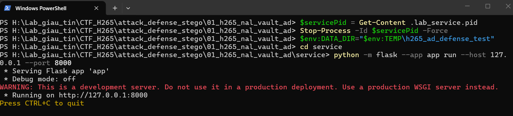

# H265 Evidence Portal AD - Writeup Defense

## 1. Mục tiêu khi phòng thủ

Defense trong bài này không phải là tắt service cho attacker hết đường khai
thác. Trong attack/defense CTF, service vẫn phải sống và checker vẫn phải dùng
được các chức năng hợp lệ:

- `/health` phải trả service còn sống.
- `/api/store` phải import case và lưu marker.
- `/api/read` phải đọc lại marker khi có đúng token.
- Dashboard `/`, `/api/cases`, `/case/<id>` và preview vẫn nên tồn tại để giữ
  đúng chức năng evidence portal.

Vì vậy bản vá tốt phải xử lý đúng kênh leak, không phá luồng nghiệp vụ.

## 2. Chứng minh lỗi trước khi vá

Chạy service:

```bash
cd attack_defense_stego/01_h265_nal_vault_ad/service
docker compose up --build -d
```

Đặt một flag mẫu bằng checker:

```bash
cd ..
python checker/checker.py put 127.0.0.1 8000 'blockChainPTIT{4ud_n4l_d3bug_l34k_br34ks_h265_v4ult}'
```

Ví dụ output:

```json
{"id":"flag_1710000000_abcd1234","token":"0123456789abcdef"}
```

Ở đây `token` là bí mật của luồng hợp lệ. Attacker không cần token nếu khai thác
preview public.

Liệt kê case public:

```bash
curl http://127.0.0.1:8000/api/cases
```

Tải preview:

```bash
curl -o preview.h265 http://127.0.0.1:8000/api/cases/flag_1710000000_abcd1234/redacted-preview.h265
```

Kiểm tra preview vẫn là HEVC:

```bash
ffprobe -v error -show_entries stream=codec_name,width,height -of default=noprint_wrappers=1 preview.h265
```

Kết quả:

```text
codec_name=hevc
width=640
height=360
```

Chạy exploit:

```bash
python solution/exploit.py http://127.0.0.1:8000 --id flag_1710000000_abcd1234
```

Nếu chưa vá, exploit in ra flag:

```text
blockChainPTIT{4ud_n4l_d3bug_l34k_br34ks_h265_v4ult}
```


Kết luận: preview public đủ dữ liệu để khôi phục marker, dù `/api/read` vẫn yêu
cầu token.

## 3. Xác định nguyên nhân gốc

Mở `service/backend/app.py`, hàm tạo preview:

```python
def _preview_bitstream(bitstream: bytes) -> bytes:
    preview = bytearray()
    for nal in find_nals(bitstream):
        # Vulnerability: the preview is playable because it keeps redacted VCL
        # frames, but it also preserves AUD timing metadata carrying the marker.
        preview += b"\x00\x00\x00\x01" + nal
    return bytes(preview)
```


Vấn đề là hàm này copy toàn bộ NAL sang preview. Nó giữ được video preview phát
được, nhưng cũng giữ luôn AUD NAL type 35.

Mở tiếp `service/backend/stego.py`, phần nhúng marker:

```python
bits = _manchester_encode(_xor_bits(_bytes_to_bits(packet), seed))
```

Packet gốc:

```text
H5AD || 2-byte length || marker || crc32(marker)
```

Sau đó service dùng cadence theo `case id` để chèn AUD giả:

```python
decoys = 1 + (next(cadence) % 3)
```

Và ghi bit thật vào AUD data:

```python
primary_pic_type = (cover << 1) | bit
aud_rbsp = bytes([(primary_pic_type << 5) | 0x10])
marker += _nal(35, aud_rbsp)
```

Điểm quan trọng: AUD giả, Manchester và XOR chỉ làm attack khó hơn. Nó không
phải defense, vì attacker có `case id` public để sinh lại cadence và mask. Nếu
AUD vẫn nằm trong preview thì marker vẫn leak.

## 4. Nguyên tắc vá đúng

Ta cần giữ các yêu cầu sau:

- Preview vẫn trả về HEVC để người dùng tải/xem được.
- Không public raw carrier yêu cầu token.
- Không làm hỏng `/api/store` và `/api/read`.
- Không để AUD chứa marker xuất hiện trong preview public.

Với bài này, cách vá gọn nhất là strip AUD NAL type 35 khi tạo preview:

```python
def _preview_bitstream(bitstream: bytes) -> bytes:
    preview = bytearray()
    for nal in find_nals(bitstream):
        if nal_type(nal) == 35:
            continue
        preview += b"\x00\x00\x00\x01" + nal
    return bytes(preview)
```


Lý do chọn cách này:

- Marker chỉ nằm trong AUD type 35.
- Các VCL frame của preview vẫn được giữ.
- Checker không phụ thuộc preview để đọc marker, checker dùng `/api/read`.
- Thay đổi nhỏ, dễ review trong A/D CTF.

## 5. Áp dụng patch mẫu

Patch đã có sẵn:

```bash
git apply solution/defense.patch
```

Có thể kiểm tra patch trước:

```bash
git apply --check solution/defense.patch
```

Nếu muốn sửa tay, chỉ cần thêm đoạn:

```python
if nal_type(nal) == 35:
    continue
```

trong vòng lặp của `_preview_bitstream`.

## 6. Rebuild service sau khi vá

Sau khi sửa code:

```bash
cd service
docker compose down
docker compose up --build -d
```

Kiểm tra service sống:

```bash
curl http://127.0.0.1:8000/health
```

Kết quả:

```json
{"ok":true}
```

Kiểm tra dashboard vẫn trả HTML:

```bash
curl http://127.0.0.1:8000/
```

Nếu thấy HTML chứa `H265 Evidence Portal` là ổn.



## 7. Kiểm tra chức năng hợp lệ không hỏng

Chạy checker tổng quát:

```bash
cd attack_defense_stego/01_h265_nal_vault_ad
python checker/checker.py check 127.0.0.1 8000
```

Output mong đợi:

```text
OK
```


Kiểm tra rõ hơn bằng `put` và `get`:

```bash
python checker/checker.py put 127.0.0.1 8000 'blockChainPTIT{4ud_n4l_d3bug_l34k_br34ks_h265_v4ult}'
```

Ví dụ output:

```json
{"id":"flag_1710000000_abcd1234","token":"0123456789abcdef"}
```

Dùng lại JSON đó:

```bash
python checker/checker.py get 127.0.0.1 8000 '{"id":"flag_1710000000_abcd1234","token":"0123456789abcdef"}' 'blockChainPTIT{4ud_n4l_d3bug_l34k_br34ks_h265_v4ult}'
```

Output mong đợi:

```text
OK
```

Điều này chứng minh defense không làm hỏng chức năng lưu và đọc marker hợp lệ.

## 8. Chứng minh exploit bị chặn

Sau khi vá, preview public vẫn tồn tại:

```bash
curl -I http://127.0.0.1:8000/api/cases/flag_1710000000_abcd1234/redacted-preview.h265
```

Nhưng exploit không còn lấy được flag:

```bash
python solution/exploit.py http://127.0.0.1:8000 --id flag_1710000000_abcd1234
```

Kết quả hợp lệ là exploit không in flag và trả exit code khác 0. Lý do là
preview không còn AUD type 35, nên attacker không còn raw bit để bỏ decoy,
decode Manchester hay XOR mask.

Có thể kiểm tra nhanh số lượng AUD trong preview sau vá bằng một script parse
NAL. Kết quả mong muốn:

```text
AUD type 35 count: 0
```


## 9. Vòng attack-defense tiếp theo

Trong attack-defense thật, defense hiếm khi kết thúc sau một bản vá đầu tiên. Đội tấn
công sẽ thử lại các giả định cũ và tìm phần còn sót. Với bài này, vòng tiếp theo rất
thực tế là stale preview cache.

### Defense 1: strip AUD khi render preview

Bản vá đầu tiên là sửa `_preview_bitstream` để bỏ AUD NAL type 35:

```python
if nal_type(nal) == 35:
    continue
```

Bản vá này đúng hướng vì nó chặn kênh chứa marker. Tuy nhiên nó chỉ tác động tới preview
được render sau khi code mới chạy.

### Attack 2: khai thác preview cũ còn nằm trong cache

Backend đang serve preview theo logic:

```python
preview_path = PREVIEW_DIR / f"{item_id}_redacted_preview.h265"
if not preview_path.exists():
    preview_path = _render_preview(item_id)
```

Nếu trước khi vá đã có người tải preview một lần, file cũ đã nằm trong `PREVIEW_DIR`.
Sau khi deploy Defense 1, service có thể vẫn trả file cũ đó, không render lại. Attacker
chỉ cần gọi lại URL cũ:

```bash
curl -L -o stale_preview.h265 http://127.0.0.1:8000/api/cases/flag_1710000000_abcd1234/redacted-preview.h265
python solution/exploit.py http://127.0.0.1:8000 --id flag_1710000000_abcd1234
```

Nếu preview cũ chưa bị xóa, exploit vẫn có thể in ra flag. Đây là một lỗi defense rất
hay gặp: vá code nhưng quên artifact đã sinh ra trước đó.

Có thể kiểm tra bằng cách đếm AUD trong file vừa tải:

```bash
python -c "from pathlib import Path; from solution.exploit import find_nals,nal_type; data=Path('stale_preview.h265').read_bytes(); print(sum(1 for n in find_nals(data) if nal_type(n)==35))"
```

Nếu kết quả lớn hơn `0`, public preview vẫn còn dữ liệu để attacker reverse.

### Defense 2: invalidate cache và render lại preview sạch

Sau khi phát hiện Attack 2, không chỉ sửa hàm render là đủ. Cần ép service không dùng
lại preview được sinh bởi sanitizer cũ. Có hai cách:

- Cách nhanh khi vận hành: xóa toàn bộ preview cache rồi restart worker.
- Cách bền hơn trong code: gắn version cho preview sanitizer, nếu cache không đúng
  version thì render lại.

Ví dụ hướng bền hơn:

```python
PREVIEW_SANITIZER_VERSION = "strip-aud-v2"
```

Khi render preview, ghi thêm file version:

```python
version_path.write_text(PREVIEW_SANITIZER_VERSION, encoding="utf-8")
```

Khi serve preview, chỉ dùng cache nếu version khớp. Nếu thiếu file version hoặc version
cũ, backend render lại preview bằng code đã strip AUD.

Patch mẫu `solution/defense.patch` đã được viết theo hướng final defense: vừa strip AUD,
vừa tránh dùng lại stale preview cache.

### Attack 3: thử lại sau Defense 2

Sau Defense 2, attacker vẫn có thể gọi các endpoint public:

```bash
curl http://127.0.0.1:8000/api/cases
curl http://127.0.0.1:8000/share/<share_id>
curl http://127.0.0.1:8000/api/share/<share_id>/manifest.json
```

Các endpoint này vẫn có thể lộ `case id`, `share id`, camera/source và đường dẫn
preview. Đây là dữ liệu public của sản phẩm, không phải lỗi. Điều quan trọng là những
dữ liệu đó không còn đủ để khôi phục flag, vì preview đã bị strip AUD.

Attacker tải lại preview:

```bash
curl -L -o preview_after_defense2.h265 http://127.0.0.1:8000/api/cases/flag_1710000000_abcd1234/redacted-preview.h265
```

Preview vẫn nên là HEVC hợp lệ:

```bash
ffprobe -v error -show_entries stream=codec_name,width,height -of default=noprint_wrappers=1 preview_after_defense2.h265
```

Nhưng số AUD NAL type 35 phải bằng `0`:

```bash
python -c "from pathlib import Path; from solution.exploit import find_nals,nal_type; data=Path('preview_after_defense2.h265').read_bytes(); print(sum(1 for n in find_nals(data) if nal_type(n)==35))"
```

Kết quả đúng:

```text
0
```

Lúc này chạy exploit phải thất bại:

```powershell
python solution/exploit.py http://127.0.0.1:8000 --id flag_1710000000_abcd1234
echo $LASTEXITCODE
```

Nếu `$LASTEXITCODE` là `2`, nghĩa là exploit đã chạy nhưng không tìm được marker hợp lệ
trong preview public.

### Attack 4: thử bypass bằng `/api/read`

Attacker không có `operator token`, nên thử đọc marker trực tiếp phải thất bại:

```bash
curl -X POST http://127.0.0.1:8000/api/read ^
  -H "Content-Type: application/json" ^
  -d "{\"id\":\"flag_1710000000_abcd1234\",\"token\":\"wrong-token\"}"
```

Kết quả đúng là request bị từ chối, ví dụ `403` hoặc JSON báo `forbidden`. Nếu route
này trả marker khi token sai thì đó là lỗi khác, không liên quan tới stego preview.

### Kết luận vòng lặp

Bản defense đạt yêu cầu khi có đủ bốn điều kiện:

- Service vẫn sống: `checker check` trả `OK`.
- Luồng hợp lệ vẫn sống: `checker put/get` đọc lại đúng flag khi có token.
- Attack sau Defense 1 được phân tích: stale cache có thể vẫn leak.
- Defense 2 xử lý được phần còn sót: cache cũ bị invalidate, public preview không còn
  AUD type 35 và exploit không lấy được flag.

## 10. Vì sao không nên vá bằng cách khác

Không nên chỉ đổi thuật toán encode phức tạp hơn, ví dụ tăng decoy, đổi XOR
mask hoặc đổi Manchester. Các cách đó chỉ trì hoãn attacker, vì nếu preview vẫn
copy kênh chứa marker thì người chơi có thể reverse tiếp.

Không nên tắt `/api/cases` hoặc `/case/<id>` nếu đề bài yêu cầu giữ chức năng
portal public. Tắt chức năng làm bài mất tính attack/defense và có thể khiến
checker hoặc workflow hợp lệ bị ảnh hưởng.

Không nên yêu cầu token cho preview nếu kịch bản sản phẩm cần public redacted
preview. Trong thực tế có thể làm vậy, nhưng với bài này defense đẹp hơn là giữ
preview public và loại bỏ đúng dữ liệu nhạy cảm khỏi preview.

## 11. Defense tốt hơn trong thực tế

Bản vá strip AUD là đủ cho bài CTF. Trong sản phẩm thật, nên làm thêm:

- Tạo preview bằng transcoder sạch thay vì copy NAL từ evidence carrier.
- Nếu cần AUD, tạo AUD mới trung tính thay vì copy AUD cũ.
- Không dùng metadata/timing field làm nơi chứa marker nhạy cảm.
- Mã hóa marker bằng key server-side nếu bắt buộc phải nhúng.
- Thêm log và rate limit cho `/api/cases/<id>/redacted-preview.h265`.
- Rotate marker/flag đã bị lộ sau khi deploy bản vá.
