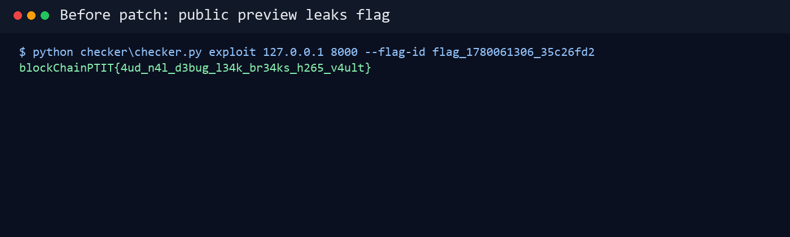
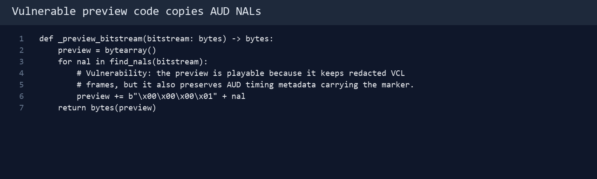
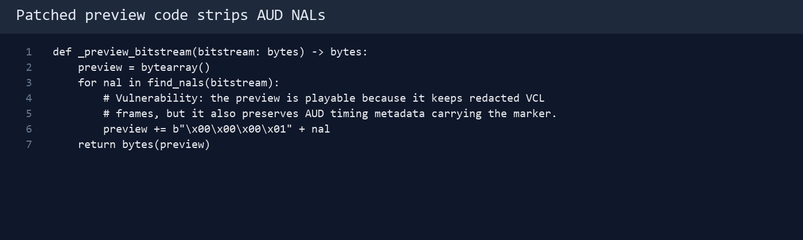
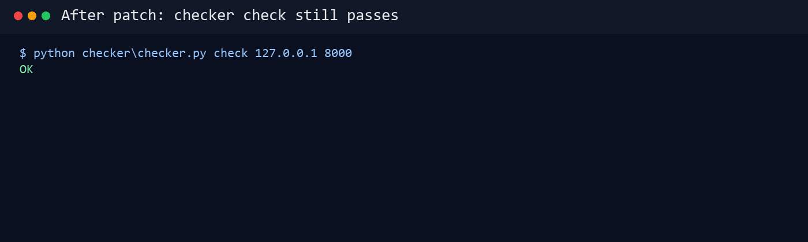
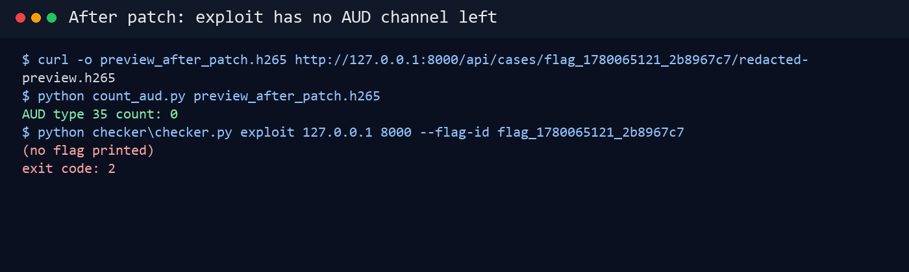

# Defense Round 1 - Strip AUD khỏi public preview

## 1. Mục tiêu phòng thủ

Defense không được tắt service hoặc chặn toàn bộ public preview. Trong attack-defense, service vẫn phải sống và checker vẫn phải dùng được:

- `/health` trả service còn sống.
- `/api/store` import case và lưu marker.
- `/api/read` đọc lại marker khi có đúng token.
- Dashboard, `/api/cases`, `/case/<id>`, share và preview vẫn tồn tại.

Vì vậy bản vá Round 1 cần chặn đúng kênh leak: AUD NAL type 35 trong public preview.

## 2. Chứng minh lỗi trước khi vá

Đặt flag mẫu:

```bash
python checker/checker.py put 127.0.0.1 8000 'blockChainPTIT{4ud_n4l_d3bug_l34k_br34ks_h265_v4ult}'
```

Tải preview public:

```bash
curl -o preview.h265 http://127.0.0.1:8000/api/cases/flag_1710000000_abcd1234/redacted-preview.h265
```

Kiểm tra preview là HEVC:

```bash
ffprobe -v error -show_entries stream=codec_name,width,height -of default=noprint_wrappers=1 preview.h265
```

Kết quả:

```text
codec_name=hevc
width=640
height=360
```

Chạy exploit:

```bash
python solution/exploit.py http://127.0.0.1:8000 --id flag_1710000000_abcd1234
```

Nếu chưa vá, exploit in ra flag.



## 3. Nguyên nhân gốc

Hàm tạo preview đang copy toàn bộ NAL sang preview:

```python
def _preview_bitstream(bitstream: bytes) -> bytes:
    preview = bytearray()
    for nal in find_nals(bitstream):
        preview += b"\x00\x00\x00\x01" + nal
    return bytes(preview)
```



Lỗi nằm ở chỗ preview public vẫn giữ AUD NAL type 35. Marker được giấu trong `primary_pic_type & 1` của AUD, nên attacker chỉ cần parse preview là lấy được bit.

## 4. Bản vá Round 1

Strip AUD khi tạo preview:

```python
def _preview_bitstream(bitstream: bytes) -> bytes:
    preview = bytearray()
    for nal in find_nals(bitstream):
        if nal_type(nal) == 35:
            continue
        preview += b"\x00\x00\x00\x01" + nal
    return bytes(preview)
```



Lý do chọn cách này:

- Marker chỉ nằm trong AUD type 35.
- VCL frame của preview vẫn được giữ.
- Checker không dùng preview để đọc marker, checker dùng `/api/read`.
- Patch nhỏ, dễ review, đúng trọng tâm.

## 5. Rebuild và kiểm tra chức năng

Rebuild service:

```bash
cd service
docker compose down
docker compose up --build -d
```

Kiểm tra health:

```bash
curl http://127.0.0.1:8000/health
```

Chạy checker:

```bash
cd attack_defense_stego/01_h265_nal_vault_ad
python checker/checker.py check 127.0.0.1 8000
```

Output mong đợi:

```text
OK
```



Kiểm tra `put/get`:

```bash
python checker/checker.py put 127.0.0.1 8000 'blockChainPTIT{4ud_n4l_d3bug_l34k_br34ks_h265_v4ult}'
python checker/checker.py get 127.0.0.1 8000 '{"id":"flag_1710000000_abcd1234","token":"0123456789abcdef"}' 'blockChainPTIT{4ud_n4l_d3bug_l34k_br34ks_h265_v4ult}'
```

Nếu `get` trả `OK`, nghĩa là luồng hợp lệ không bị hỏng.

## 6. Kiểm tra exploit Round 1 bị chặn

Tải preview mới:

```bash
curl -L -o preview_after_patch.h265 http://127.0.0.1:8000/api/cases/flag_1710000000_abcd1234/redacted-preview.h265
```

Đếm AUD:

```bash
python -c "from pathlib import Path; from solution.exploit import find_nals,nal_type; data=Path('preview_after_patch.h265').read_bytes(); print(sum(1 for n in find_nals(data) if nal_type(n)==35))"
```

Kết quả mong đợi:

```text
0
```

Chạy exploit:

```powershell
python solution/exploit.py http://127.0.0.1:8000 --id flag_1710000000_abcd1234
echo $LASTEXITCODE
```

Nếu `$LASTEXITCODE` là `2`, exploit không tìm được marker hợp lệ.



## 7. Hạn chế của Defense Round 1

Defense Round 1 chỉ sửa logic render preview mới. Nếu preview cũ đã được sinh trước khi vá và vẫn nằm trong cache, backend có thể tiếp tục trả file cũ đó.

Đây là điểm mở ra Attack Round 2.
