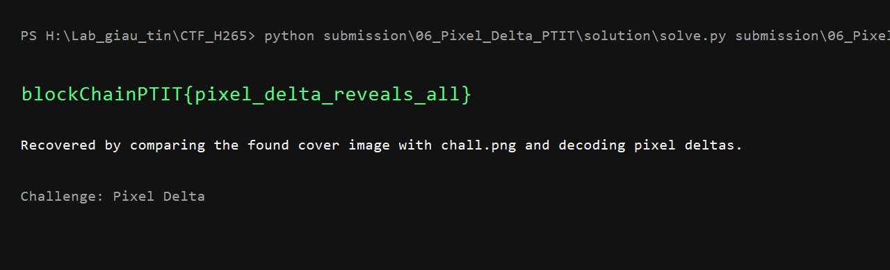

# Pixel Delta - Writeup

## 1. Thông tin ban đầu

Người chơi chỉ nhận được:

```text
chall.png
HINT.txt
```

Nội dung hint:

```text
Nếu tôi muốn gửi một thông điệp giấu tin qua Internet, chắc chắn tôi sẽ tự viết thuật toán riêng.
Đừng vội cắm ảnh vào hàng loạt công cụ stego ngẫu nhiên rồi mong thấy flag. Không có đâu.
```

Vì vậy hướng đi ban đầu không phải là brute-force các tool stego có sẵn, mà phải xem ảnh như một thuật toán giấu tin tự chế.

## 2. Thử các kiểm tra cơ bản

Trước hết kiểm tra nhanh các dấu hiệu dễ thấy:

```bash
file chall.png
strings chall.png | grep -i blockChainPTIT
exiftool chall.png
binwalk chall.png
```

Không thấy flag trong chuỗi ASCII, metadata hay file nhúng. Ảnh cũng mở bình thường, không có dấu hiệu bị hỏng.

## 3. Tìm ảnh cover gốc

Với các bài steganography trên ảnh, nếu thuật toán sửa pixel rất nhẹ thì ảnh cover gốc thường là chìa khóa. Dựa vào hình trong `chall.png`, dùng reverse image search như Google Lens/TinEye/Yandex Images để tìm ảnh gốc hoặc ảnh giống hệt trước khi bị nhúng dữ liệu.

Sau khi tìm được ảnh cover, lưu lại thành:

```text
original.png
```

Trong gói lời giải của ban tổ chức, file `solution/original.png` chính là ảnh cover đã tìm được để tái hiện bước này. Đây không phải file phát cho người chơi.

## 4. So sánh pixel

Mở `original.png` và `chall.png`, rồi so sánh từng pixel theo cùng thứ tự. Khi in thử các sai khác nhỏ giữa hai ảnh, ta thấy mẫu rất đều:

```text
Blue delta = 1  -> pixel này được dùng làm vị trí chứa dữ liệu
Red delta  = 0  -> bit 0
Red delta  = 1  -> bit 1
```

Nói cách khác, kênh Blue đánh dấu pixel nào có dữ liệu, còn kênh Red chứa bit thật sự.

Đoạn trích xuất chính:

```python
bits = []
for x in range(original.size[0]):
    for y in range(original.size[1]):
        ro, _, bo, _ = original.getpixel((x, y))
        rs, _, bs, _ = chall.getpixel((x, y))
        if bs - bo == 1:
            bits.append(str(rs - ro))
```

Sau đó ghép mỗi 8 bit thành một byte và tìm chuỗi có định dạng `blockChainPTIT{...}`.

## 5. Chạy solver

Script giải:

```text
solution/solve.py
```

Nếu đã có ảnh cover `original.png`:

```bash
python solution/solve.py original.png public/chall.png
```

Trong thư mục bài nộp, có thể chạy trực tiếp bằng ảnh cover lưu trong `solution/`:

```bash
python solution/solve.py solution/original.png public/chall.png
```

Kết quả:

```text
blockChainPTIT{pixel_delta_reveals_all}
```

Ảnh minh chứng:



Flag:

```text
blockChainPTIT{pixel_delta_reveals_all}
```
