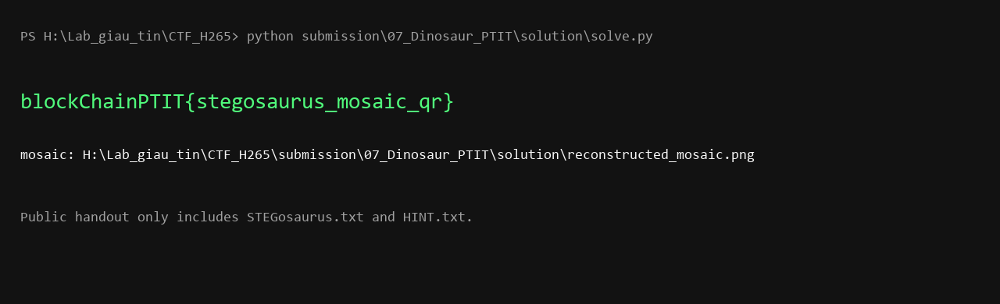

# Dinosaur - Writeup

## 1. Khảo sát file

Bài phát cho người chơi:

```text
STEGosaurus.txt
HINT.txt
```

Mô tả/hint bám theo đề gốc ImaginaryCTF 2025:

```text
Mọi người đều có một loài khủng long yêu thích. Bạn đoán được của tôi là gì không?
```

Mở `STEGosaurus.txt` không thấy flag plaintext, mà thấy rất nhiều token lặp lại:

```text
imagine rooOreos rooZyphen harold why rooFrozenVoid ...
```

Trong bài gốc, các token này là tên emoji từ Discord của ImaginaryCTF. Vì vậy hướng đi là thu thập/export bộ emoji tương ứng, rồi dùng tên trong `STEGosaurus.txt` làm bản đồ tile. Trong gói lời giải này, bộ tile tham chiếu nằm ở:

```text
solution/emoji_tiles/
```

File text không phải để đọc trực tiếp, mà là bản đồ sắp xếp tile.

## 2. Dựng lại mosaic

Đọc toàn bộ token trong `STEGosaurus.txt`, với mỗi token lấy ảnh tile cùng tên, rồi ghép theo thứ tự từ trái sang phải, từ trên xuống dưới.

Vì tổng số token là một số chính phương, có thể suy ra mosaic là hình vuông:

```python
side = int(math.isqrt(len(tokens)))
```

Mỗi tile được resize về cùng kích thước, sau đó paste vào ảnh lớn:

```python
for index, token in enumerate(tokens):
    tile = Image.open(f"emoji_tiles/{token}.png").convert("RGB")
    x = (index % side) * TILE_SIZE
    y = (index // side) * TILE_SIZE
    mosaic.paste(tile, (x, y))
```

Ảnh dựng lại có dạng một QR code lớn.


## 3. Scan QR

Sau khi dựng mosaic, scan QR bằng điện thoại hoặc dùng OpenCV. Nếu detector không đọc được ảnh quá lớn, resize ảnh xuống rồi scan lại.

Đoạn decode bằng OpenCV:

```python
detector = cv2.QRCodeDetector()
image = cv2.imread("reconstructed_mosaic.png")
text, _, _ = detector.detectAndDecode(image)
```

## 4. Chạy solver

Script giải:

```text
solution/solve.py
```

Chạy:

```bash
python solution/solve.py public/STEGosaurus.txt solution/emoji_tiles
```

Kết quả:

```text
blockChainPTIT{stegosaurus_mosaic_qr}
```

Ảnh minh chứng:



Flag:

```text
blockChainPTIT{stegosaurus_mosaic_qr}
```
