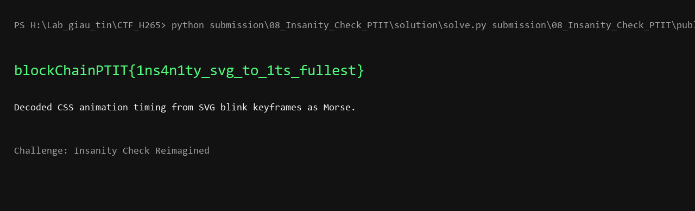

# Insanity Check Reimagined - Writeup

## 1. Khảo sát ban đầu

Bài cho 3 file:

```text
demo_page.html
favicon.svg
HINT.txt
```

Mình mở `demo_page.html` trước. Trang gần như trống, chỉ có một dòng load favicon:

```html
<link rel="icon" href="favicon.svg" type="image/svg+xml" />
```

Hint cũng nói không cần brute-force hay quét thư mục, nên mình tập trung vào file `favicon.svg`.

## 2. Vì sao SVG đáng nghi

SVG là XML, không chỉ chứa nét vẽ mà còn có thể chứa CSS animation. Khi mở `favicon.svg`, mình thấy có một hình ổ khóa và một block CSS khá dài.

Phần đáng chú ý là animation tên `blink`:

```css
@keyframes blink {
  0.000% { fill: #FFFF; }
  0.288% { fill: #FFF6; }
  ...
}
```

Nó được gắn vào hình vuông ở giữa ổ khóa:

```css
.center {
  animation: blink 1200s infinite;
  animation-delay: 10s;
  animation-timing-function: steps(1, end);
}
```

Hai trạng thái `#FFFF` và `#FFF6` giống như bật/tắt. Các mốc thời gian lại không đều nhau, nên mình nghi phần animation này đang giấu dữ liệu bằng độ dài tín hiệu.

## 3. Trích tín hiệu bật/tắt

Mình lấy riêng các mốc trong `@keyframes blink`, rồi parse thành cặp:

```text
phần trăm thời gian, trạng thái fill
```

Ví dụ:

```text
0.000,FFFF
0.288,FFF6
0.576,FFFF
0.865,FFF6
1.153,FFFF
```

Sau đó tính khoảng cách giữa hai mốc liên tiếp. Nếu trạng thái hiện tại là `#FFFF` thì đó là thời gian “bật”; nếu là `#FFF6` thì đó là thời gian “tắt”.

Khi nhìn các khoảng thời gian, mình thấy chúng gom về các bội số của một đơn vị nhỏ. Đây là dấu hiệu rất giống Morse:

```text
bật ngắn  -> .
bật dài   -> -
tắt vừa   -> hết chữ
tắt dài   -> hết từ
```

## 4. Decode Morse

Sau khi map các đoạn bật/tắt sang Morse, thông điệp đọc được là:

```text
blockchainptit 1ns4n1ty svg to 1ts fullest
```

Ghép lại theo format flag:

```text
blockChainPTIT{1ns4n1ty_svg_to_1ts_fullest}
```

## 5. Xác nhận bằng solver

Script giải nằm ở:

```text
solution/solve.py
```

Chạy:

```bash
python solution/solve.py public/favicon.svg
```

Output:

```text
blockChainPTIT{1ns4n1ty_svg_to_1ts_fullest}
```

Ảnh minh chứng:



Flag:

```text
blockChainPTIT{1ns4n1ty_svg_to_1ts_fullest}
```
