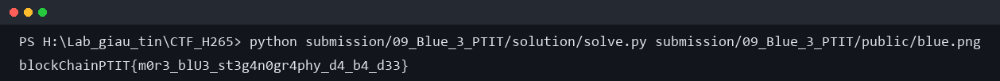

# Blue 3? - Writeup

## 1. Nhìn file ban đầu

Bài chỉ cho một file ảnh:

```text
blue.png
```

Mở ảnh lên thì gần như chỉ thấy một mảng xanh. Lúc đầu mình thử các bước quen tay
như `file`, xem metadata, rồi nhìn bằng mắt thường, nhưng không có chuỗi flag hay
file bị nối thêm ở cuối.

Vì ảnh quá phẳng, mình chuyển sang kiểm tra phân bố màu. Nếu đây là ảnh một màu
thật sự thì số màu xuất hiện phải rất ít, thậm chí chỉ có một màu chính.

## 2. Tìm màu nền

Dùng Python/Pillow đếm tần suất pixel, mình thấy có một màu xuất hiện áp đảo. Đây
gần như chắc chắn là màu nền của ảnh.

Sau đó mình lấy từng pixel trừ màu nền. Những pixel khác nền chỉ lệch đúng một chút
ở một trong các kênh RGB, nên hướng này có vẻ đúng hơn `binwalk` hay `strings`.

Khi vẽ/quan sát các pixel bị lệch, chúng không rải đều toàn ảnh mà nằm theo các vùng
nhỏ chạy dọc đường chéo. Đây là điểm quan trọng nhất của bài.

## 3. Đoán cách chia vùng

Mình chưa biết flag dài bao nhiêu, nhưng format là `blockChainPTIT{...}`. Vì các
vùng nằm trên đường chéo, mình thử giả sử ảnh được chia thành `n` ô vuông nhỏ, mỗi
ô ứng với một ký tự.

Với mỗi độ dài `n`, làm như sau:

```text
1. Chia ảnh thành n vùng trên đường chéo.
2. Với vùng thứ i, cộng toàn bộ độ lệch RGB so với màu nền.
3. Chuyển tổng đó thành chr(total).
4. Ghép các ký tự lại và kiểm tra format flag.
```

Nếu đoán sai `n`, chuỗi thu được là ký tự rác. Khi `n` đúng, tổng độ lệch trong
mỗi vùng rơi đúng vào mã ASCII.

## 4. Chạy solver

Script giải nằm ở:

```text
solution/solve.py
```

Chạy:

```bash
python solution/solve.py public/blue.png
```

Output:

```text
blockChainPTIT{m0r3_blU3_st3g4n0gr4phy_d4_b4_d33}
```

Ảnh minh chứng:



Flag:

```text
blockChainPTIT{m0r3_blU3_st3g4n0gr4phy_d4_b4_d33}
```
