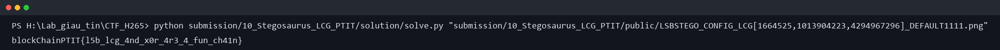

# Stegosaurus LCG - Writeup

## 1. Nhìn file public

Bài cho một ảnh PNG có tên rất dài:

```text
LSBSTEGO_CONFIG_LCG[1664525,1013904223,4294967296]_DEFAULT1111.png
```

Tên file gần như đang tự thú. Mình tách được ba mẩu thông tin:

```text
LSBSTEGO        -> khả năng cao là giấu bit trong least significant bit
LCG[...]        -> thứ tự đọc pixel dùng Linear Congruential Generator
DEFAULT1111     -> seed/password/config mặc định
```

Mở ảnh bằng mắt thường không thấy gì đặc biệt. Mình thử đọc LSB tuần tự theo RGB
trước, nhưng dữ liệu ra không có magic, không có text rõ ràng. Vậy phần `LCG[...]`
trong tên file không phải trang trí.

## 2. Dựng lại thứ tự pixel

LCG có dạng:

```text
X(n+1) = (a * X(n) + c) mod m
```

Từ tên file:

```text
a = 1664525
c = 1013904223
m = 4294967296
```

Mình dùng `DEFAULT1111` để sinh seed ổn định bằng SHA-256. Sau đó mỗi giá trị LCG
được lấy modulo tổng số pixel để ra vị trí cần đọc. Với mỗi pixel, lấy lần lượt LSB
của ba kênh RGB.

Khi đọc đúng thứ tự, 6 byte đầu ra:

```text
BCPT + 2 byte độ dài
```

Đây là điểm xác nhận mình đã chọn đúng LCG và đúng khóa.

## 3. Giải lớp XOR

Phần sau header không phải flag plaintext ngay. Dữ liệu là ciphertext. Vì tên file
có `DEFAULT1111`, mình thử dùng chính chuỗi này làm khóa để sinh keystream bằng
SHA-256 rồi XOR ngược lại.

Sau khi XOR, plaintext thu được là flag hoàn chỉnh.

## 4. Chạy solver

Script giải nằm ở:

```text
solution/solve.py
```

Chạy:

```bash
python solution/solve.py "public/LSBSTEGO_CONFIG_LCG[1664525,1013904223,4294967296]_DEFAULT1111.png"
```

Output:

```text
blockChainPTIT{l5b_lcg_4nd_x0r_4r3_4_fun_ch41n}
```

Ảnh minh chứng:



Flag:

```text
blockChainPTIT{l5b_lcg_4nd_x0r_4r3_4_fun_ch41n}
```
